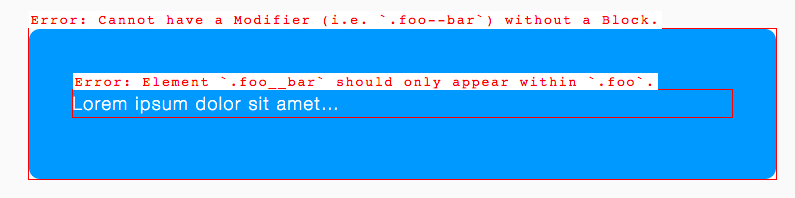

# Nudge

**Give developers a gentle push in the right direction.**

Nudge is an ITCSS-compatible library that detects misuse of certain CSS
selectors, and gives developers a subtle nudge to fix them. Mistakes and
incorrect usage gets highlighted in the UI.

## Installation

## Usage

Using Nudge is relatively simple. For more in-depth information and
documentation, please see the comments in the relevant files.

### Including in your project

* `@import` `_tools.nudge.scss` into your _Tools_ layer (if you are not using
  ITCSS, `@import` it somewhere toward the beginning of your project).
* `@import` `_trumps.nudge.scss` into your _Trumps_ layer (if you are not using
  ITCSS, `@import` it somewhere toward the end of your project).

### Configuring

You can disable Nudge by setting `$nudge-enabled` to `false` just before you
`@import` `_tools.nudge.scss`, i.e.:

    $nudge-enabled: false;
    @import "tools.nudge";

Disabling Nudge will give warnings in your output stream: we don’t really want
people turning Nudge off if we’ve purposely included it in a project.

#### Deprecated Selectors

To configure our deprecated selectors, simply copy/paste the
`$nudge-deprecated-selectors` map out of `_trumps.nudge.scss` and into your
manifest file (e.g. `main.scss`). Place it just before your `@import` for the
`_trumps.nudge.scss` file, then elete the `!default` flag and replace the
example selectors with your own, e.g.:

    $nudge-deprecated-selectors: (
      '.btn': '.c-btn',
    );
    @import "trumps.nudge";
